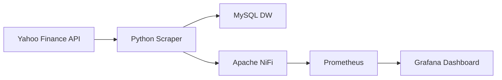

## Pipeline de Monitoramento de Criptomoedas em Tempo Real

O objetivo deste projeto é demonstrar a extração dos dados de Criptomoedas da API pública do Yahoo Finance - **yfinance** - utilizando um script python, e também a preservação desses dados coletados em uma Data Warehouse construída no MySQL. Os dados dessa DW serão usados em análises exploratórias posteriores, relatórios e dashboards (Power BI e Grafana) e também aplicarei um modelo de ML para análises preditivas. Este primeiro projeto também servirá para demonstrar como deve ser feita a preparação para o uso de um Scraper de dados na API em questão: foram feitos testes na API para analisar o formato dos dados brutos e também foram observados os princípios do **ACID** (Atomicidade, Consistência, Isolamento, Durabilidade) na preparação do Scraper e das tabelas do MySQL. 

**Tecnologias Utilizadas**

<p align="left">
  <a href="https://www.python.org/" target="_blank">
    
  </a>
  <a href="https://www.mysql.com/" target="_blank">
    
  </a>
 <a href="https://nifi.apache.org/" target="_blank">
  
</a>
  <a href="https://prometheus.io/" target="_blank">
    
  </a>
  <a href="https://grafana.com/" target="_blank">
    
  </a>
  <a href="https://www.docker.com/" target="_blank">
    
  </a>
</p>

**Linguagem	Python 3.10+** -	Desenvolvimento do scraper e scripts de exploração e de testes.

**Banco de Dados MySQL 8.0** - Data Warehouse para armazenamento dos dados coletados.

**Orquestração	Apache NiFi**	- Gerenciamento do fluxo de métricas do scraper para o Prometheus.

**Monitoramento	Prometheus** - Coleta e armazenamento de métricas de séries temporais do Scraper.

**Visualização no Grafana** -	Criação de dashboards interativos para monitoramento.

**Containerização	Docker & Docker Compose**	- Orquestração de todo o ambiente de forma isolada e reproduzível.

**S.O. Host	Windows (via WSL2)**	- Ambiente de desenvolvimento principal.


Este projeto implementa uma solução completa que simula um ambiente de produção para ingestão de dados financeiros. O objetivo é demonstrar competências práticas em todo o ciclo de vida dos dados:




## Coleta: Um scraper em Python, resiliente a falhas, coleta dados de cotações de Criptomoedas da API do Yahoo Finance.


## Armazenamento Estruturado: Os dados são enviados para a tabela **raw_crypto** na Data Warehouse dimensional, modelado no MySQL, prontos para análises.


**Query da consulta** - gera um ranking de símbolos (symbol) baseado em três dimensões: liquidez (volume médio), qualidade (percentual de registros válidos) e freshness (última coleta). Também seleciona as melhores criptomoedas que atendem aos critérios mínimos de qualidade que, nesse caso, foram todas, para formar uma lista priorizada.
```
WITH stats AS (
  SELECT
    symbol,
    COUNT(*) AS cnt_obs,
    MAX(`timestamp`) AS last_ts,
    ROUND(SUM(is_valid=1)/COUNT(*)*100,4) AS pct_valid,
    ROUND(SUM(price_usd = 0)/COUNT(*)*100,4) AS pct_zero,
    AVG(volume_24h_usd) AS avg_volume,
    STDDEV_SAMP(price_usd) AS price_stddev
  FROM raw_crypto
  GROUP BY symbol
),
ranks AS (
  SELECT
    *,
    PERCENT_RANK() OVER (ORDER BY avg_volume) AS vol_pr,    -- 0..1, maior volume => mais próximo de 1
    PERCENT_RANK() OVER (ORDER BY pct_valid) AS valid_pr,  -- 0..1, maior pct_valid => melhor
    PERCENT_RANK() OVER (ORDER BY last_ts) AS fresh_pr     -- 0..1, mais recente => melhor
  FROM stats
)
SELECT
  symbol,
  cnt_obs,
  last_ts,
  pct_valid,
  pct_zero,
  ROUND(avg_volume,2) AS avg_volume,
  ROUND(price_stddev,8) AS price_stddev,
  ROUND((0.60*vol_pr + 0.30*valid_pr + 0.10*fresh_pr),4) AS score
FROM ranks
WHERE
  pct_valid >= 90          -- exige pelo menos 90% de registros válidos
  AND pct_zero <= 5        -- no máximo 5% de preços iguais a 0
  AND cnt_obs >= 50        -- mínimo de 50 históricos (apenas para demonstração, não é relevante para o dataset atual (13 cryptomoedas)
  AND last_ts >= (NOW() - INTERVAL 24 HOUR) -- coleta recente (24h)
ORDER BY score DESC
LIMIT 100;
```


## Orquestração de Dados: O Apache NiFi gerencia o fluxo de metadados e métricas geradas pelo scraper.


## Observabilidade e SRE (Site Reliability Engineering): Métricas de saúde e desempenho do Scraper são enviadas ao Prometheus, onde os cálculos das métricas mais importantes já são feitos através do recording-rules.yaml do prometheus, com base em SLOs pré-determinados e, por fim, as métricas mais relevantes são visualizadas no Grafana, incluindo um dashboard de SLO (Service Level Objective) para monitorar a confiabilidade do pipeline.


## Alertas, baseados em certos **thresholds** de performance/disponibilidade, também foram feitos usando o Alertmanager, onde a configuração dos requisitos dos alertas é feita no **alert.rules.yaml**. Em um ambiente Cloud, como AWS ou Google Cloud, processos de auto-remediações seriam realizados de acordo com o nível de urgência, este já pré-determinado, em cada alerta. Caso as auto-remediações não fossem suficientes, só então um DevOps de plantão iria intervir para analisar e remediar o problema.


**Obs**: A latência p99 reportada é do ciclo completo do scraping (vários tickers em sequência) e não por requisições individuais. Nenhum impacto negativo foi observado na coleta dos dados. Ainda estou avaliando se modifico o scraper para refletir melhor a latência real do processo, mas, no momento, isso é de baixa prioridade.


Este projeto não é apenas sobre coletar dados, mas é também sobre construir um **sistema confiável**, **monitorável** e que segue as melhores práticas da indústria.


## Arquitetura

O sistema é dividido em duas vias principais: o fluxo de dados (coleta e armazenamento) e o fluxo de métricas (monitoramento e observabilidade).

**Scraper (Python)**: O yahoo_scraper.py é executado periodicamente para buscar os dados.

**MySQL**: Atua como Data Warehouse, armazenando os dados brutos e, posteriormente, tabelas agregadas (Star Schema).

**Apache NiFi**: Recebe um payload JSON do scraper via uma requisição HTTP a cada execução (dois segundos), contendo métricas como latência, número de registros e status.

**Prometheus**: Configurado para extrair as métricas do NiFi e armazená-las como séries temporais. Seria possível também mandar as métricas direto do scraper, mas um dos objetivos desse projeto é demonstrar a construção de um pipeline de dados completo.

**Grafana**: Conecta o Prometheus como fonte de dados, para exibir dashboards de métricas relevantes.

Destaque: Boas Práticas de Coleta e Tratamento (ACID)

Uma das principais preocupações em pipelines de dados é garantir a integridade e a confiabilidade. Este projeto implementa várias práticas para isso, alinhadas aos princípios ACID e de idempotência.

## Atomicidade: Transações "Tudo ou Nada"

Para garantir que a carga de um lote de dados seja atômica (ou tudo é gravado, ou nada é), o scraper utiliza transações explícitas no banco de dados.

No Scraper (yahoo_scraper.py): A função upsert_dataframe_to_raw envolve todas as operações de INSERT de um lote dentro de um bloco try/except. O conn.commit() só é chamado se todas as operações executemany forem bem-sucedidas. Em caso de qualquer erro, conn.rollback() é chamado, desfazendo a transação e garantindo que dados parciais não sejam persistidos.

Python

**Trecho da função upsert_dataframe_to_raw**
```
try:
    conn.start_transaction()
    for i in range(0, len(rows), BATCH_SIZE):
        batch = rows[i:i+BATCH_SIZE]
        cursor.executemany(UPSERT_SQL, batch)

    conn.commit()  # Só confirma se tudo deu certo
except Error as e:
    conn.rollback() # Desfaz tudo em caso de erro
```
## Consistência e Durabilidade: Integridade dos Dados

A consistência é garantida tanto na aplicação quanto no banco de dados que, por sua vez, assegura a durabilidade.

No Schema do MySQL (raw_crypto):

O uso de **ENGINE=InnoDB** é fundamental, pois este é o motor de armazenamento padrão do MySQL, que suporta transações ACID.

Tipos de dados rigorosos como DECIMAL(20,8) para preços e DATETIME(6) para timestamps evitam erros de arredondamento e garantem a precisão.

Constraints como NOT NULL e FOREIGN KEY (nas tabelas dimensionais) garantem a integridade referencial. Uma vez que uma transação é "commitada", o InnoDB garante que ela seja durável e resista a falhas.

SQL

```-- Garantindo consistência com tipos de dados e constraints
CREATE TABLE IF NOT EXISTS raw_crypto (
    id INT AUTO_INCREMENT PRIMARY KEY,
    symbol VARCHAR(20) NOT NULL,
    price_usd DECIMAL(20,8),
    timestamp DATETIME(6) NOT NULL,
    -- ...
    UNIQUE KEY unique_symbol_ts (symbol, timestamp)
) ENGINE=InnoDB;
Idempotência: Execuções Repetidas Sem Efeitos Colaterais
```
Em pipelines de dados, é crucial que uma tarefa possa ser reexecutada sem duplicar dados.

No Scraper: A função truncate_to_hour normaliza o timestamp, garantindo que múltiplas coletas dentro da mesma hora resultem na mesma chave temporal.

No MySQL: A instrução ON DUPLICATE KEY UPDATE é a chave para a idempotência. Se um registro com a mesma chave única (symbol, timestamp) já existir, em vez de gerar um erro ou duplicar, ele simplesmente atualiza os valores. Isso torna o pipeline seguro para reexecuções.

```SQL

-- Instrução de UPSERT
INSERT INTO raw_crypto (...) VALUES (...)
ON DUPLICATE KEY UPDATE
    price_usd = VALUES(price_usd),
    -- ...
;
```


Este projeto serve como uma base sólida. Os próximos passos podem explorar áreas mais avançadas:

**Curto Prazo**:

Tratamento dos dados seguindo a metodologia CRISP-DM, para fazer análises exploratórias e dashboards interativos no Power BI e dashboards de monitoração de SLIs, SLOs e Error Budgets no Grafana.

**Médio Prazo**:

Modelagem Preditiva: Utilizar os dados históricos para treinar um modelo de machine learning para, por exemplo, prever tendências de preço.

**Longo Prazo**:

Continuar treinando o modelo de ML para análises mais precisas.

Licença
Este projeto está sob a licença MIT.
