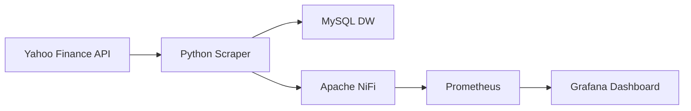

## Pipeline de Monitoramento de Criptomoedas em Tempo Real

Neste projeto, estarei demonstrando a extração dos dados de Criptomoedas de uma API Pública do Yahoo Finance - **yfinance** - utilizando um script python, e também a preservação desses dados coletados em um Data Warehouse feita no MySQL. Os dados dessa DW serão usados em análises exploratórias posteriores, relatórios e dashboards (Power BI e Grafana) e também aplicarei um modelo de ML para análises preditivas. Este primeiro projeto também servirá para demonstrar como deve ser feita a preparação para o uso de um Scraper de dados na API em questão: foram feitos testes na API para analisar o formato dos dados brutos e também foram observados os princípíos do **ACID** (Atomicidade, Consistência, Isolamento, Durabilidade) na preparação do Scraper e das tabelas do MySQL. 

**Tecnologias Utilizadas**

<p align="left">
  <a href="https://www.python.org/" target="_blank">
    
  </a>
  <a href="https://www.mysql.com/" target="_blank">
    
  </a>
 <a href="https://nifi.apache.org/" target="_blank">
  
</a>
  <a href="https://prometheus.io/" target="_blank">
    
  </a>
  <a href="https://grafana.com/" target="_blank">
    
  </a>
  <a href="https://www.docker.com/" target="_blank">
    
  </a>
</p>

**Linguagem	Python 3.10+** -	Desenvolvimento do scraper e scripts de exploração e de testes.

**Banco de Dados MySQL 8.0** - Data Warehouse para armazenamento dos dados coletados.

**Orquestração	Apache NiFi**	- Gerenciamento do fluxo de métricas do scraper para o Prometheus.

**Monitoramento	Prometheus** - Coleta e armazenamento de métricas de séries temporais do Scraper.

**Visualização no Grafana** -	Criação de dashboards interativos para monitoramento.

**Containerização	Docker & Docker Compose**	- Orquestração de todo o ambiente de forma isolada e reproduzível.

**S.O. Host	Windows (via WSL2)**	- Ambiente de desenvolvimento principal.


Este projeto implementa uma solução completa que simula um ambiente de produção para ingestão de dados financeiros. O objetivo é demonstrar competências práticas em todo o ciclo de vida dos dados:




## Coleta Robusta: Um scraper em Python, resiliente a falhas, coleta dados de cotações de Criptomoedas da API do Yahoo Finance.


## Armazenamento Estruturado: Os dados são persistidos em um Data Warehouse dimensional modelado em MySQL, pronto para análises.


## Orquestração de Dados: O Apache NiFi gerencia o fluxo de metadados e métricas geradas pelo scraper.


## Observabilidade e SRE: Métricas de saúde e desempenho do Scraper são enviadas ao Prometheus e visualizadas no Grafana, incluindo um dashboard de SLO (Service Level Objective) para monitorar a confiabilidade do pipeline.


Este projeto não é apenas sobre coletar dados, mas é também sobre construir um **sistema confiável**, **monitorável** e que segue as melhores práticas da indústria.


## Arquitetura

O sistema é dividido em duas vias principais: o fluxo de dados (coleta e armazenamento) e o fluxo de métricas (monitoramento e observabilidade).

Code snippet

graph TD
    subgraph "Fonte de Dados Externa"
        A[Yahoo Finance API]
    end

    subgraph "Aplicação Principal (Docker)"
        B(Python Scraper) -- Coleta de dados --> A
        B -- 1. Armazena dados brutos --> C[MySQL Data Warehouse]
        B -- 2. Envia métricas da execução --> D[Apache NiFi]
    end

    subgraph "Plataforma de Observabilidade (Docker)"
        D -- Encaminha métricas --> E[Prometheus]
        E -- Armazena séries temporais --> E
        F[Grafana] -- Consulta e visualiza --> E
    end

    subgraph "Data Warehouse (Docker)"
        C
    end

    style B fill:#3498db,stroke:#2980b9,color:#fff
    style C fill:#f39c12,stroke:#e67e22,color:#fff
    style D fill:#e74c3c,stroke:#c0392b,color:#fff
    style E fill:#9b59b6,stroke:#8e44ad,color:#fff
    style F fill:#2ecc71,stroke:#27ae60,color:#fff
**Scraper (Python)**: Executa periodicamente para buscar os dados mais recentes.

**MySQL**: Atua como Data Warehouse, armazenando os dados brutos e, posteriormente, tabelas agregadas (dimensional).

**Apache NiFi**: Recebe um payload JSON do scraper via uma requisição HTTP a cada execução, contendo métricas como latência, número de registros e status.

**Prometheus**: Configurado para extrair as métricas do NiFi (ou diretamente de um endpoint do scraper) e armazená-las como séries temporais.

**Grafana**: Conecta-se ao Prometheus como fonte de dados para exibir os dashboards de monitoramento.

Destaque: Boas Práticas de Coleta e Tratamento (ACID)

Uma das principais preocupações em pipelines de dados é garantir a integridade e a confiabilidade. Este projeto implementa várias práticas para isso, alinhadas aos princípios ACID e de idempotência.

## Atomicidade: Transações "Tudo ou Nada"

Para garantir que a carga de um lote de dados seja atômica (ou tudo é gravado, ou nada é), o scraper utiliza transações explícitas no banco de dados.

No Scraper (yahoo_scraper.py): A função upsert_dataframe_to_raw envolve todas as operações de INSERT de um lote dentro de um bloco try/except. O conn.commit() só é chamado se todas as operações executemany forem bem-sucedidas. Em caso de qualquer erro, conn.rollback() é chamado, desfazendo a transação e garantindo que dados parciais não sejam persistidos.

Python

**Trecho da função upsert_dataframe_to_raw**
```
try:
    conn.start_transaction()
    for i in range(0, len(rows), BATCH_SIZE):
        batch = rows[i:i+BATCH_SIZE]
        cursor.executemany(UPSERT_SQL, batch)

    conn.commit()  # Só confirma se tudo deu certo
except Error as e:
    conn.rollback() # Desfaz tudo em caso de erro
```
Consistência e Durabilidade: Integridade dos Dados

A consistência é garantida tanto na aplicação quanto no banco de dados, que por sua vez assegura a durabilidade.

No Schema do MySQL (raw_crypto):

O uso de **ENGINE=InnoDB** é fundamental, pois é o motor de armazenamento padrão do MySQL que suporta transações ACID.

Tipos de dados rigorosos como DECIMAL(20,8) para preços e DATETIME(6) para timestamps evitam erros de arredondamento e garantem a precisão.

Constraints como NOT NULL e FOREIGN KEY (nas tabelas dimensionais) garantem a integridade referencial. Uma vez que uma transação é "commitada", o InnoDB garante que ela seja durável e resista a falhas.

SQL

```-- Garantindo consistência com tipos de dados e constraints
CREATE TABLE IF NOT EXISTS raw_crypto (
    id INT AUTO_INCREMENT PRIMARY KEY,
    symbol VARCHAR(20) NOT NULL,
    price_usd DECIMAL(20,8),
    timestamp DATETIME(6) NOT NULL,
    -- ...
    UNIQUE KEY unique_symbol_ts (symbol, timestamp)
) ENGINE=InnoDB;
Idempotência: Execuções Repetidas Sem Efeitos Colaterais
```
Em pipelines de dados, é crucial que uma tarefa possa ser reexecutada sem duplicar dados.

No Scraper: A função truncate_to_hour normaliza o timestamp, garantindo que coletas múltiplas dentro da mesma hora resultem na mesma chave temporal.

No MySQL: A instrução ON DUPLICATE KEY UPDATE é a chave para a idempotência. Se um registro com a mesma chave única (symbol, timestamp) já existir, em vez de gerar um erro ou duplicar, ele simplesmente atualiza os valores. Isso torna o pipeline seguro para reexecuções.

```SQL

-- Instrução de UPSERT
INSERT INTO raw_crypto (...) VALUES (...)
ON DUPLICATE KEY UPDATE
    price_usd = VALUES(price_usd),
    -- ...
;
```


Este projeto serve como uma base sólida. Os próximos passos podem explorar áreas mais avançadas:

**Curto Prazo**:

Tratamento dos dados seguindo a metodologia CRISP-DM, para fazer análises exploratórias e dashboards interativos no Power BI e dashboards de monitoração de SLIs, SLOs e Error Budgets no Grafana.

**Médio Prazo**:

Modelagem Preditiva: Utilizar os dados históricos para treinar um modelo de machine learning para, por exemplo, prever tendências de preço.

**Longo Prazo**:

Continuar treinando o modelo de ML para análises mais precisas.

Licença
Este projeto está sob a licença MIT.
